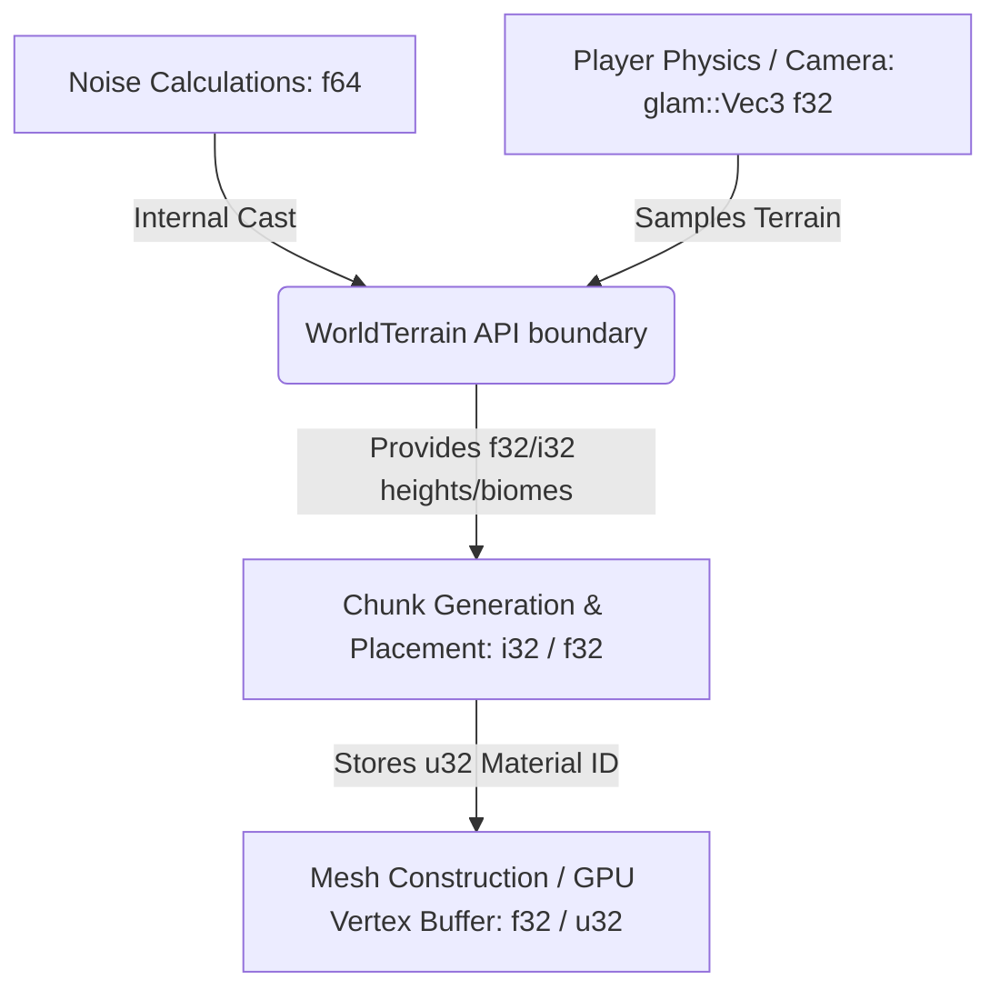

# Technical Design Document: Type Refactoring and Casting Cleanup

## 1. Context & Motivation

Currently, the `ruxel` codebase contains over 240 instances of the `as` cast operator. This density of casting stems from a lack of unified boundary definitions between the various coordinate systems and math representation levels in the engine:

1. **Procedural Math & Noise Space**: The `noise` crate operates on `f64` values (`Fbm<Perlin>`, etc.).
2. **Entity & Physics Space**: Collision handling, camera tracking, and vector algebra are computed in `f32` (via `glam::Vec3` and `glam::Quat`).
3. **Chunk Grid Columns**: High-level chunk coordinates are kept in `glam::UVec2` (or `glam::IVec2`).
4. **Voxel Coordinate Grid**: Solid coordinates are expressed as `i32` or `u32` (e.g., `set_block(x, y, z)`).
5. **Array Indices**: Local chunk sub-arrays (`[[[Block; 16]; 16]; 16]`) must be indexed using `usize`.

Because type conversions are performed inline at call sites rather than at component boundaries, the codebase is verbose and prone to precision loss or truncation bugs.

This document establishes design principles and code changes to unify the engine's type systems.

---

## 2. Architecture Principles

To eliminate inline casting, we establish a strict boundary model:



### Type Assignments

* **Noise Mathematics**: Kept strictly as `f64` inside the generator structs (`PlainsTerrain`, `DesertTerrain`, etc.) to prevent precision loss during complex fractional scaling.
* **Terrain Sampling Output**: Heights, moisture, and temperature are exposed as `f32`.
* **Block Coordinates**: Always represented as signed integers (`i32` or `glam::IVec3`).
* **Chunk Column Coordinates**: Kept as `glam::UVec2` (as they are guaranteed positive), but cleanly converted through defined traits rather than inline `as` casts.

---

## 3. Detailed API & Structural Changes

### 3.1. Refactoring `WorldTerrain` and `TerrainData`

Currently, `TerrainData` stores its fields as `f64`:

```rust
pub struct TerrainData {
    pub height: f64,
    pub biome: Biome,
    pub moisture: f64,
    pub temperature: f64,
}
```

We will convert this to:

```rust
pub struct TerrainData {
    pub height: f32,
    pub biome: Biome,
    pub moisture: f32,
    pub temperature: f32,
}
```

The primary query function `WorldTerrain::get` is currently defined as:

```rust
pub fn get(&self, world_point: [f64; 2]) -> TerrainData
```

We will refactor it to accept a standard `glam::Vec2` or `(f32, f32)` type:

```rust
pub fn get(&self, point: glam::Vec2) -> TerrainData {
    let px = point.x as f64 / Self::WORLD_SCALE;
    let py = point.y as f64 / Self::WORLD_SCALE;
    
    // Internal calculations remain f64...
    let final_height: f64 = ...; 
    
    TerrainData {
        height: final_height as f32,
        biome: primary_biome,
        moisture: ((moisture_noise + bound) / divisor) as f32,
        temperature: ((temperature_noise + bound) / divisor) as f32,
    }
}
```

### 3.2. Cleanups in `src/chunks.rs`

Currently, chunk generation calls `terrain.get()` by casting coordinates to `f64` manually:

```rust
let point: [f64; 2] = [blockx as f64, blockz as f64];
let tdata = terrain.get(point);
let height = tdata.height as f32; // double-cast
```

With the new API, this becomes:

```rust
let tdata = terrain.get(glam::Vec2::new(blockx as f32, blockz as f32));
let height = tdata.height; // Already f32!
```

### 3.3. Cleanups in `src/poisson.rs` and `src/trees.rs`

Vegetation placement checks heights using `f64` terrain queries and then casts to `f32` for distance math.
By shifting `WorldTerrain::get` to accept `glam::Vec2` and return `f32` height, we eliminate dozens of castings from vegetation generation.

---

## 4. Migration Plan

1. **Step 1: Modify `src/terrain.rs`**
   * Update `TerrainData` field types.
   * Refactor `WorldTerrain::get` signature and internal wrapping.
   * Refactor helper queries like `is_pure_biome` and `find_closest_pure_biome`.
2. **Step 2: Update callers in `src/chunks.rs`**
   * Adapt `load_chunks` to pass `glam::Vec2` to `terrain.get`.
   * Update height assertions and biome generation rules.
3. **Step 3: Update `src/poisson.rs` and `src/trees.rs`**
   * Clean up distance metrics and terrain sampling.
4. **Step 4: Update other mesh/rendering layers**
   * Refactor type mismatches in `src/mesh.rs` and `src/entities.rs`.
