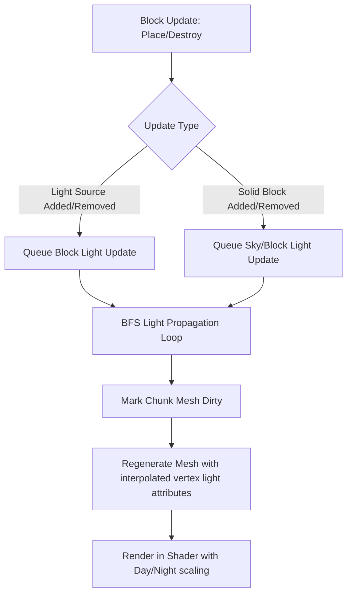

# Technical Design: 3D Voxel Light Propagation System (Option B)

This document details the technical design for implementing a dual-channel (Sky Light & Block Light) voxel light propagation system in Ruxel. This system will resolve ambient lighting issues in caves, under overhangs, and inside structures, while enabling dynamic light sources (like torches).

---

## 1. Overview & Architecture

Voxel lighting in this system is computed on a grid on the CPU using a **BFS-based Flood Fill Algorithm** and then passed to WGPU via vertex attributes for shading.



### Key Principles
- **Dual Channel**: Light is divided into **Sky Light** (from the sky, scaling with time of day) and **Block Light** (constant light emitted by blocks like torches).
- **Scale**: Light values range from `0` (pitch black) to `15` (fully lit).
- **Attenuation**: Light decays by `1` for each step it propagates orthogonally (left, right, forward, backward, up, down). Solid blocks obstruct light entirely.

---

## 2. Voxel Data Structures

To keep memory overhead minimal, we pack both light channels into a single byte (`u8`) per voxel:
- **Bits 0–3**: Sky Light Level (`0–15`)
- **Bits 4–7**: Block Light Level (`0–15`)

### Data Layout Changes
We modify `Chunk` to store a dedicated array of light states parallel to the blocks array:

```rust
pub struct Chunk {
    blocks: [[[Block; 16]; 16]; 16],
    // Packs sky light (4 bits) and block light (4 bits) per block
    light: [[[u8; 16]; 16]; 16], 
    start: Vec3,
    version: u32,
}

impl Chunk {
    #[inline]
    pub fn get_sky_light(&self, x: usize, z: usize, y: usize) -> u8 {
        self.light[x][z][y] & 0x0F
    }

    #[inline]
    pub fn get_block_light(&self, x: usize, z: usize, y: usize) -> u8 {
        (self.light[x][z][y] >> 4) & 0x0F
    }

    #[inline]
    pub fn set_light(&mut self, x: usize, z: usize, y: usize, sky: u8, block: u8) {
        self.light[x][z][y] = (sky & 0x0F) | ((block & 0x0F) << 4);
    }
}
```

---

## 3. Light Propagation Algorithms

Light propagation uses a Breadth-First Search (BFS) queue. We execute propagation at two levels:
1. **Intra-chunk**: Light propagating within the $16 \times 16 \times 16$ block grid.
2. **Inter-chunk**: Light propagating across chunk boundaries into neighboring chunks.

### 3.1 Sky Light Propagation
Sky light propagates down from the top of the world.
1. **Initial Downward Sweep**: In any column, sky light starts at `15` at the maximum height (`Y = 255`). It moves down vertically. As long as it traverses transparent blocks (like air or water), it remains at `15`.
2. **Obstruction**: Once it hits a solid block, the downward vertical propagation stops.
3. **Horizontal Scattering**: Any air block that has a sky light level of `15` acts as a light source. It pushes light into neighboring orthogonal air blocks with a decay of `1` (light level becomes `14`, then `13`, etc.).

### 3.2 Block Light Propagation
Block light propagates outward from light-emitting blocks:
1. **Sources**: Emissive blocks (e.g. `Block::Type::Torch` with emission level `14`) push their light value to their immediate orthogonal air neighbors.
2. **Flood Fill**: Air blocks propagate the light to their neighbors, decreasing the level by `1` per step.

### 3.3 Dynamic Updates: Block Placement & Destruction
When a block is modified at coordinates `(x, y, z)`, light changes must propagate dynamically. We maintain two queues: `propagate_queue` (nodes to spread light) and `remove_queue` (nodes where light was diminished).

#### Case A: Solid Block Placed (Obstruction Added)
1. Get the current light values $S$ (sky) and $B$ (block) at the coordinate.
2. Set the block's light levels to `0`.
3. Add the coordinates to the `remove_queue`.
4. Run a BFS to un-propagate light: Set neighbors to `0` if their light was dependent on this node, and enqueue them into `remove_queue`.
5. If any neighbor had a light source independent of this block, enqueue them to `propagate_queue` to rebuild light in the cleared area.
6. Run the standard BFS propagation queue.

#### Case B: Solid Block Destroyed (Obstruction Removed)
1. Look at the 6 orthogonal neighbors of the destroyed block.
2. Find the highest neighboring light values: $S_{max}$ and $B_{max}$.
3. Set the coordinate's light to $\max(0, S_{max} - 1)$ and $\max(0, B_{max} - 1)$.
4. Enqueue the coordinate to `propagate_queue` to spread the new light into the cleared space.
5. Run the BFS propagation queue.

---

## 4. Meshing & Smooth Lighting

To avoid harsh, blocky lighting steps, we implement **Bilinear Vertex Light Interpolation** (similar to the current vertex ambient occlusion calculation).

```
   p2 (x, y+1)          p3 (x+1, y+1)
      +----------------------+
      |                      |
      |          * Vertex    |
      |                      |
      +----------------------+
   p0 (x, y)            p1 (x+1, y)
```

### 4.1 Vertex Light Retrieval
For any face vertex, we inspect the light levels of the 8 surrounding voxel corners:
1. Retrieve the light levels of the voxels surrounding the vertex.
2. Average their light levels to calculate the light value at the vertex corner.
3. Since we have two light channels, we calculate a separate averaged `sky_light` and `block_light` for the vertex.

### 4.2 Vertex Layout Pack
We pack the interpolated light levels into the WGPU `Vertex` structure. Since WGPU vertices are performance-sensitive, we can store these in the `normal_and_ao` attribute or as a separate byte attributes array.

An elegant layout update would add a `light` attribute:
```rust
#[repr(C)]
#[derive(Copy, Clone, Debug, Pod, Zeroable)]
pub struct Vertex {
    position: [f32; 3],
    material: u32,
    color: [u8; 4],
    normal_and_ao: [i8; 4],
    // [sky_light, block_light, 0, 0] scaled to 0..255
    light_levels: [u8; 4], 
}
```

---

## 5. Shader Integration

### 5.1 Vertex Shader (`shader.wgsl`)
We pull the `light_levels` attribute in the vertex input, scale it back to `0.0..1.0`, and pass it to the fragment shader.

```wgsl
struct VertexInput {
  @location(0) position: vec3<f32>,
  @location(1) material: u32,
  @location(2) color: vec4<f32>,
  @location(3) normal_and_ao: vec4<f32>,
  @location(4) light_levels: vec4<f32>, // Normalized Unorm8x4
}

struct VertexOutput {
  @builtin(position) clip_position: vec4<f32>,
  @location(0) color: vec4<f32>,
  @location(1) world_normal: vec3<f32>,
  @location(2) world_position: vec3<f32>,
  @location(3) ao: f32,
  @location(4) @interpolate(flat) material: u32,
  @location(5) sky_light: f32,
  @location(6) block_light: f32,
}
```

### 5.2 Fragment Shader (`shader.wgsl`)
In the fragment shader, we use the light levels to compute ambient and direct diffuse lighting:

1. **Ambient Light Calculation**:
   Instead of applying uniform `sky.color.xyz * 0.1`, we scale the sky's ambient color using the vertex's `sky_light` value modulated by the **time of day** (e.g. sun height). Block light provides a constant base ambient color (representing torch/artificial light).
2. **Direct Light Shadowing**:
   Direct light (sun/moon) is multiplied by `sky_light` to ensure shadow map leaks inside caves are completely blacked out.

```wgsl
@fragment
fn fs_main(in: VertexOutput) -> @location(0) vec4<f32> {
  // Day/night scaling: sky light intensity dims at night
  let day_night_factor = max(0.01, sky.sun_dir.y); 
  let sky_ambient = sky.color.xyz * (in.sky_light * day_night_factor);
  
  // Torch/block light is constant and warm/orange
  let block_ambient = vec3<f32>(1.0, 0.6, 0.3) * (in.block_light * 0.8); 
  
  var ambient_light = (sky_ambient + block_ambient) * 0.15;

  // Modulate direct lighting using sky_light to prevent shadow map leaks inside caves
  let sun_diffuse = light_color(lights[0], in.world_position, in.world_normal) * sun_shadow_factor * in.sky_light;
  let moon_diffuse = light_color(lights[1], in.world_position, in.world_normal) * moon_shadow_factor * in.sky_light;

  let total_diffuse = ambient_light + sun_diffuse + moon_diffuse;
  
  // Apply ambient occlusion and final color
  let base_color = in.color.xyz * get_texture_noise(in.world_position, in.material);
  var result = total_diffuse * base_color * in.ao;
  
  // Fog and final return...
  return vec4<f32>(result, in.color.w);
}
```

---

## 6. Performance Optimization Strategies

Since Ruxel runs on CPU-side loading threads, lighting propagation can be fully optimized to maintain high frame rates:
- **Lazy Updates**: Compute light values inside the background chunk loader thread (`chunks.rs`) when a chunk is loaded, rather than on the main render thread.
- **Border Caching**: When loading a chunk column, read light values from adjacent loaded chunks to correctly propagate borders, preventing boundary lighting discontinuities.
- **Bitwise Fast Paths**: Use fast bitwise operations for setting and getting light values to minimize lookup costs.
