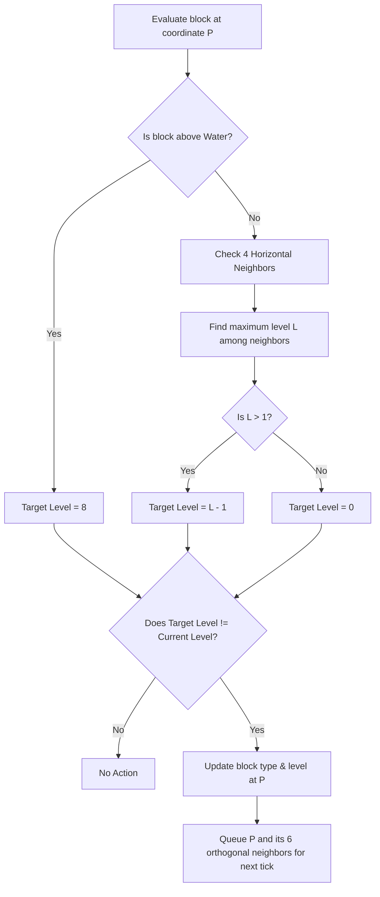
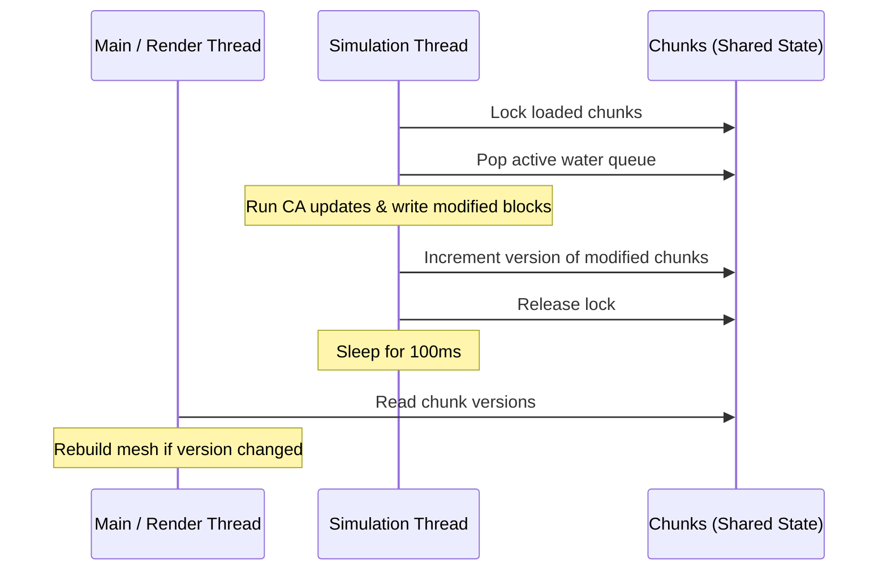

# Technical Design Document: Asynchronous Water Flow Simulation

## 1. Context & Motivation

Water blocks in `ruxel` are currently static; they are generated up to `WATER_LEVEL` (32.0) but do not react to player modifications or terrain changes.

Implementing dynamic water flow adds interactive mechanics (e.g., creating waterfalls, flooding caves, draining reservoirs). However, simulating fluid updates on the main thread can introduce render loop stutter/jitter due to the potentially large number of voxel evaluations.

This design introduces a **cellular automaton-based fluid simulation** executing on a dedicated background thread, communicating changes back to the main thread via shared state.

---

## 2. Block Representation & Metadata

To support finite fluid flow (preventing a single block from flooding the entire world), water must possess a propagation metric:

1. **`level` property**:
   - We extend the `Block` struct in `src/block.rs` to store a `level: u8` field.
   - For `Type::Water`, `level` ranges from `1` to `8`:
     - `8` represents **source water** (placed by a player or naturally generated).
     - `7` down to `1` represent **flowing water** with decreasing depth.
     - For all non-water block types, `level = 0`.
2. **Serialization Impact**:
   - Because `Block` is serialized using `bincode` during chunk persistence, adding this field changes the serialized layout. Old binary save files will need to be deleted or regenerated.

```rust
#[derive(Debug, Copy, Clone, Serialize, Deserialize)]
pub struct Block {
    ty: Type,
    level: u8,
}
```

---

## 3. Cellular Automaton Flow Rules

A queue-based simulation checks active coordinates `p = (x, y, z)` and evaluates state changes:



### Flow Details

- **Vertical Flow (Gravity)**: If there is air (`Type::Inactive`) below a water block, it flows down. The target below becomes `Water` with `level = 8`.

- **Horizontal Flow**: If the block below is solid (not air and not water), water attempts to spread horizontally. It checks the 4 adjacent horizontal neighbors. If they are `Inactive`, they become `Water` with `level = current_level - 1`.
- **Receding / Evaporation**: If a water block no longer has a neighbor of a higher level or a water block above it, its target level drops or becomes `Inactive` (level 0).

---

## 4. Threading & Synchronization Architecture

To keep the game thread smooth, fluid updates are offloaded to a background simulation thread.



### Components

1. **Thread-Safe Queue**: We store `water_queue: Arc<Mutex<Vec<glam::IVec3>>>` inside `Chunks`.
2. **Simulation Loop**:
   - Spawns in `Chunks::new` via `thread::spawn`.
   - Iterates at a fixed tick rate (e.g. 100ms).
   - In each tick:
     - Swaps the active queue to process: `let mut jobs = std::mem::take(&mut *self.water_queue.lock().unwrap());`.
     - Processes CA logic, writing updates to `loaded` chunks.
     - Increments chunk and boundary neighbor versions so the renderer knows to rebuild their meshes.
     - Queues newly affected positions.
3. **Chunk Boundaries**:
   - If a flow calculation crosses into an unloaded chunk, the update is ignored. It will naturally resume when the chunk is loaded and neighbors are updated.

---

## 5. Performance Optimizations

1. **Active Queue Only**: By only processing positions in `water_queue` (rather than scanning the entire loaded grid), the processing cost scales with active flow frontlines rather than world volume.
2. **Deduplication**: Keep a temporary `HashSet` during queue gathering to avoid processing the same coordinates multiple times in a single tick.
3. **Lock Minimization**: The simulation thread holds the lock to the `loaded` chunks Mutex only during the brief execution of a tick, ensuring the main thread is not blocked when preparing frame data.

---

## 6. Rendering & Geometry Impact

During chunk mesh generation in `src/mesh.rs`, transparent blocks are identified and meshed. The `level` property of water blocks can be handled in two ways visually:

### Approach A: Constant Height (Simple)

* **Behavior**: All water blocks (both source and flowing, levels 1-8) are rendered as full `1.0 x 1.0 x 1.0` cubes.
- **Pros**:
  - Extremely simple to implement.
  - Zero performance overhead in the mesher.
  - Internal face culling works identically to other solid/transparent blocks.
- **Cons**: Flowing water at the edges will appear as full blocks, which looks less realistic for shallow flows.

### Approach B: Level-Based Height (Polished)

* **Behavior**: The height of a water block's mesh is dynamically adjusted based on its `level` field.
- **Geometry Adjustments**:
  - The top face ($Y+$) vertex heights are offset from `pos.y + 1.0` to `pos.y + (level as f32 / 8.0)`.
  - The top edges of the side faces ($X+$, $X-$, $Z+$, $Z-$) are clamped to the same height (`pos.y + (level as f32 / 8.0)`).
- **Pros**: Creates smooth, sloped flows representing shallow water running thin at the boundaries.
- **Cons**: Requires custom height calculation in `src/mesh.rs` for transparent blocks depending on their level.

### Recommendation

Start with **Approach A** to verify cellular automaton correctness and background thread synchronization. Once the flow logic behaves correctly, we can upgrade the mesher in `src/mesh.rs` to **Approach B** for visual polish.
